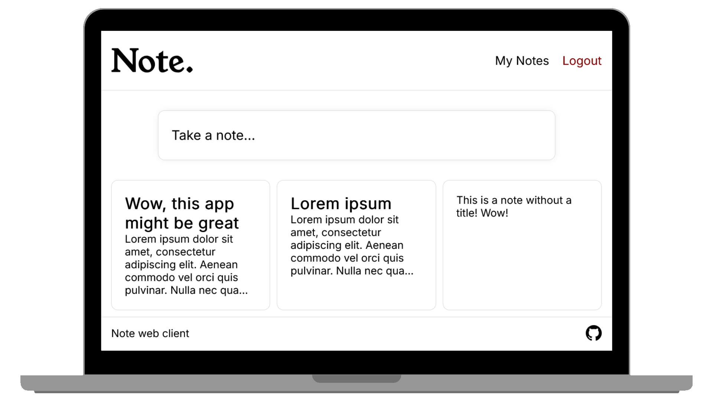

  

# Note

A simple note-taking web app created using Preact. It allows users to create and view their notes, edit them, and delete them, with notes being stored on the server.

*Requires a compatible backend such as [Note-backend](https://github.com/ethrydevelops/note-backend)*

## Installation
1. Clone this repository with `git clone https://github.com/ethrydevelops/note.git`

2. Install dependencies with `npm install`.

3. Start hosting this with `npm start` or build it with `npm run build`.

4. Star and [buy me a coffee <3](https://liberapay.com/eatery1234)!

